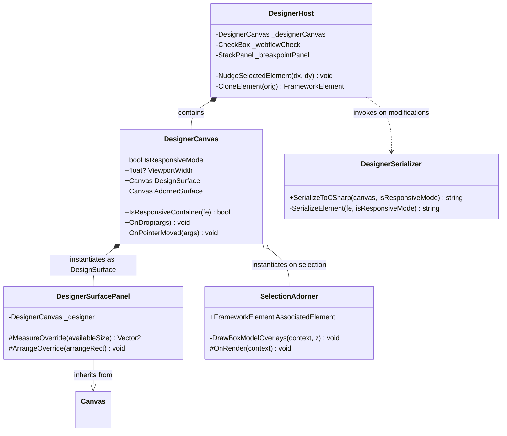

# Webflow-Style Responsive Layout Mode: Architectural Design Document

This document outlines the architectural implementation and logic for the optional **Webflow Responsive Mode** inside the ProGPU Visual Designer. This feature ports Webflow's structured design paradigm, preventing arbitrary absolute coordinate placements in favor of structured responsive layouts, cascading viewports, and visual spacing box models.

---

## 1. Architectural Philosophy: Flow Layouts vs. Absolute Position

Standard desktop designers often rely on absolute coordinate positioning (e.g. `Canvas.Left`, `Canvas.Top`), which yields layouts that are fragile, non-responsive, and break under screen size changes, DPI scaling, or dynamic text expansion.

Webflow solves this problem by enforcing a structured layout hierarchy:
* **The Stacking Root**: The page body behaves as a vertical flow block.
* **Containers First**: You cannot drop interactive elements (buttons, inputs) directly on the canvas; you must drop a panel (e.g. Section, Container, Grid, or Div Block) first.
* **Auto-Flow**: Child elements within panels are positioned by the container's layout rules (vertical stack, horizontal flow, or defined grid cells) rather than absolute coordinates.
* **Margins/Paddings for Spacing**: Horizontal and vertical offsets are governed strictly by margins, paddings, and alignment properties rather than hardcoded X/Y pixels.
* **Cascading viewports**: Layout boundaries can be configured and previewed using responsive device boundaries (Desktop, Tablet, Mobile) which horizontally center the viewport and reflow elements.
* **Visual Box Models**: When an element is selected, its spacing parameters (Margin & Padding) are drawn on the canvas as distinct translucent highlight overlays.

---

## 2. Component Pipeline and Class Relationships

Below is the design of the Webflow Mode components within the ProGPU Visual Designer:

---

## 3. Detailed Subsystem Implementation

### A. Root Surface Vertical Stacking (`DesignerSurfacePanel`)
Instead of instantiating a raw absolute `Canvas` for the root `DesignSurface`, we subclass it with `DesignerSurfacePanel`. 
* **Measurement Override**: When `IsResponsiveMode` is active, it queries each visual child, measures it with unrestricted vertical constraints, takes the maximum width among them, and sums their desired heights to determine the aggregate height.
* **Arrangement Override**: Instead of placing elements at their `Canvas.Left` and `Canvas.Top` coordinates, it arranges child containers sequentially from top to bottom, setting their bounds to stretch horizontally spanning the full width of the canvas.

### B. Cascading viewports and Device Mockup Boundaries
To support responsive previews, `DesignerCanvas` implements the `ViewportWidth` property:
1. **Measurement Restricting**: During `MeasureOverride` in `DesignerCanvas`, if `ViewportWidth` has a value (e.g. `768f` for Tablet, `375f` for Mobile), the available measurement width passed to `DesignSurface` is confined to that specific width constraint. This forces StackPanels and Grids set to Stretch alignment to reflow immediately.
2. **Horizontal Centering**: During `ArrangeOverride`, if `ViewportWidth` is set, `leftOffset = (arrangeRect.Width - ViewportWidth.Value) / 2f` is computed. The design surface is arranged inside a horizontally centered bounds rectangle offset by `leftOffset`.
3. **Viewport Outlines**: Sleek vertical device boundaries are drawn on the left and right screen borders of the mockup container using a subtle, theme-aware translucent brush during `OnRender` on the `DesignerCanvas`.
4. **Breakpoint Toggles**: The `DesignerHost` implements visual toggle buttons (🖥️ Desktop, 📟 Tablet, 📱 Mobile) in the action bar. Toggling viewports forces a dynamic arrange pass, updating selection adorner boxes and marking active states.

### C. Spacing Box Overlays (Figma/Webflow Highlights)
When a control is selected:
* The `SelectionAdorner` draws visual box models around the selected control in `OnRender`.
* **Margin Highlight**: Rendered as a translucent orange box (`rgba(250, 112, 51, 0.20)`) representing the external `Margin` offsets.
* **Padding Highlight**: Rendered as a translucent green/teal box (`rgba(61, 209, 155, 0.22)`) representing internal element `Padding` boundaries.
* Drawn first in the adorner rendering pipeline so that the active selection border and resize thumb handles remain cleanly visible on top.

### D. Element Placement Restrictions & Auto-Stretching
When the user drags a tool from the `Toolbox` and drops it onto the surface:
1. **Purity Checking**: Standard `Canvas` container drops are blocked entirely to prevent absolute-coordinate sub-zones.
2. **Leaf Rejection**: If the target container under the cursor is the root `DesignSurface` canvas itself, we check if the tool is an interactive leaf control (e.g., `Button`, `TextBox`, `TextBlock`). If so, the drop is rejected, and a clear console warning is printed.
3. **Auto-Stretching**: If the tool is a responsive container (e.g., `StackPanel`, `Grid`, `Border`, `ScrollViewer`, `WrapPanel`, `DockPanel`), it is allowed at the root. To force immediate responsiveness:
   - Its fixed `Width` constraint is cleared (set to `float.NaN`).
   - Its `HorizontalAlignment` is set to `HorizontalAlignment.Stretch`.
   - Its `Height` is set to a default visual placeholder of `100f` so it remains visible and drop-targetable when empty.

### E. Stack Drag Reordering
To rearrange components at the root level, standard dragging (which adjusts absolute coordinates) is disabled:
- We track the cursor's logical position inside the root canvas.
- As the dragged element moves, we identify all top-level sibling panels on the root.
- We compare the mouse position with each sibling's physical center coordinate (`siblingPos.Y + height / 2f`).
- We compute the precise target index and dynamically clear and re-populate the root `Children` collection. This achieves smooth, real-time vertical drag reordering.

### F. Margin Nudging
To adjust spacing without absolute positioning, standard keyboard nudges are intercepted:
- When a control is nudged (using the arrow keys), instead of mutating `Canvas.Left` and `Canvas.Top`, we adjust the selected element's `Margin` properties (specifically `Margin.Left` and `Margin.Top` based on the horizontal and vertical nudge vector).
- Shift+Arrows nudges by `10f`, while standard arrows nudge by `1f`.
- Minimum margin clamps are enforced at `0f` to prevent layout overlaps.

### G. Responsive Code Serialization
The `DesignerSerializer` handles production-ready C# code generation. When `IsResponsiveMode` is active:
- It propagates the responsive mode flag recursively through all element serialization steps.
- It suppresses the output of coordinate attachments (`Canvas.SetLeft` and `Canvas.SetTop`).
- The resulting factory code compiles into a beautifully responsive, layout-driven visual tree that naturally reflows under different window boundaries.

---

## 4. Diagnostic & Best Practices
* **Cascading Layout Workflow**: Always build your base layout on Desktop. Then, toggle to Tablet or Mobile to verify how panels reflow, and use standard `Margin` spacing to make granular design updates for smaller device viewports.
* **Box Model Spacing Guides**: Spacing overlays provide instant visual inspection. If an element isn't aligning correctly, select it to view its orange (margin) and green (padding) footprint.
* **Zero Absolute Footprints**: When designing templates intended for responsive distribution, ensure Webflow Responsive Mode is checked *before* construction to automatically enforce structural hierarchy constraints from the start.
