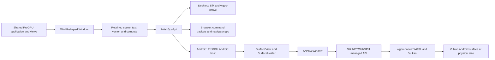

# Native Android WebGPU host

ProGPU's Android host runs the same shared application, controls, retained
scene, shaders, and renderer used by the desktop, browser, and iPhone samples.
It presents directly to an Android `SurfaceView` through WebGPU and
`wgpu-native`'s Vulkan backend. It does not embed a browser, render through an
Android `Canvas`, read pixels back through Skia, or depend on MAUI, Uno, or
AndroidX.

## Architecture



The useful part of the browser architecture is the typed, platform-neutral
`IWebGpuApi` and external-window boundary. Android reuses that boundary but not
the browser command encoder, JavaScript decoder, worker transport, or canvas.
The managed renderer calls the same Silk.NET WebGPU C ABI as desktop directly
inside the application process.

The native host has four ownership layers:

1. A .NET Android activity owns lifecycle, native platform services, and one
   shared ProGPU `Window`.
2. A `SurfaceView` owns Android surface production. `SurfaceHolder.Callback`
   announces when the surface is safe to acquire, resize, or release.
3. The host converts the Java `Surface` to a reference-counted
   `ANativeWindow*`, creates the WebGPU Android surface descriptor, and gives
   physical buffer dimensions to `WgpuContext`.
4. The existing compositor owns the adapter, device, queue, swapchain
   configuration, retained resources, and presentation. A display-synchronized
   `Choreographer.FrameCallback` asks the ordinary external-renderer path to
   render only while the activity and surface are active.

The framebuffer is always the surface's physical pixel width and height.
Layout and input remain in view-independent logical units, derived from the
current display density. This preserves ProGPU's physical-pixel glyph atlas and
quarter-physical-pixel text snapping contract without scaling a completed
frame in the platform compositor.

`ANativeWindow_fromSurface` acquires a native-window reference. The host
releases that exact reference after the WebGPU surface and compositor stop
using it. Activity pause and surface destruction are separate events: the
frame callback is paused immediately, surface-dependent GPU objects are
detached in submission order, and host-neutral application/window state stays
alive for a later surface. A terminal WebGPU device loss requires a new
instance, adapter, device, and generation of device-dependent resources;
retained CPU scene and text layout results remain reusable.

## Direct Vulkan performance contract

Android selects a hardware Vulkan adapter and uses WebGPU's Android native
window surface. There is no JavaScript serialization, intermediate bitmap,
`TextureView`, OpenGL presentation bridge, or second scene graph. Shader
modules remain the same embedded WGSL resources used by desktop. Pipelines,
bind groups, atlases, texture uploads, and compiled scenes retain their normal
lazy caches and invalidation generations.

ProGPU theme, vector, image, and text channels are retained as encoded sRGB
values and written directly by the established desktop compositor. Surface
selection therefore prefers `Bgra8Unorm`, then `Rgba8Unorm`, before accepting
an advertised fallback. Selecting an `*Srgb` attachment would apply the sRGB
transfer curve a second time and wash out dark colors. The Android view also
disables the platform's full-view default focus highlight: ProGPU owns focus
visuals, and a translucent Android highlight over the edge-to-edge
`SurfaceView` would modify the entire presented frame after mouse or trackpad
focus.

`Choreographer` supplies the stable frame timestamp for animation and aligns
submission with the display cadence. The host does not run a free-running
timer or advance animations twice. It stops scheduling while invisible,
paused, or surface-less and resumes without unconditionally invalidating the
shared scene. Android may change refresh rate, density, rotation, and surface
extent independently; each is reported through the portable window/display
contract before the next frame.

The pinned wgpu-native release enables Vulkan and GLES together for Unix
targets in its own Cargo metadata; that backend union cannot be narrowed with
a public feature in this ABI revision. ProGPU builds with only the `wgsl`
shader-input feature and requests Vulkan at runtime. GLSL and SPIR-V shader
input remain disabled. GLES is therefore dormant compatibility code, not a
selected ProGPU presentation path. A future Silk/wgpu-native ABI upgrade may
remove it if upstream exposes an Android Vulkan-only feature boundary.

## Native dependency and ABI contract

The Android host uses the .NET Android workload and ProGPU's existing
Silk.NET.WebGPU binding. Its only added native component is `libwgpu_native.so`.
Silk.NET.WebGPU 2.23.0 was generated for the WebGPU C ABI represented by
wgpu-native commit
`33133da4ec5a0174cb21539ef2d3346f75200411`. Newer wgpu-native callback-info,
surface-chain, device-callback, and render-pass layouts are not drop-in
compatible. Upgrade the managed binding and native commit in one reviewed
change.

[`eng/build-wgpu-native-android.sh`](../eng/build-wgpu-native-android.sh)
checks out that exact commit into ignored `artifacts/`, uses its locked Cargo
graph, enables only `wgsl`, and cross-links with the selected Android NDK. The
default output is:

```text
artifacts/wgpu-native-android/
├── BUILD-MANIFEST.txt
├── SHA256SUMS
├── include/
│   ├── webgpu.h
│   └── wgpu.h
├── lib/
│   ├── arm64-v8a/libwgpu_native.so
│   └── x86_64/libwgpu_native.so
└── licenses/
```

ARM64 is built by default. The x64 library is optional and intended for x64
emulators. Release builds use thin LTO, one codegen unit, disabled incremental
compilation, remapped source paths, a content-derived ELF build ID, stripped
unneeded symbols, and a manifest/checksum record. These inputs make repeated
builds deterministic when the Rust and NDK toolchain versions recorded in the
manifest are also held constant. Third-party source and build output remain
ignored external artifacts; no upstream implementation is copied into ProGPU.

## Build, AOT, and deployment

Prerequisites:

- .NET 10 SDK with the Android workload (`dotnet workload install android`);
- an Android SDK, platform tools, API 24 or newer, and an installed NDK;
- the JDK version required by the installed .NET Android workload;
- Rust and Cargo (the build script installs requested Rust target components);
- a Vulkan-capable physical Android device, or an emulator configured with a
  Vulkan-capable GPU backend.

Point the build at the NDK and create the ARM64 native library:

```bash
export ANDROID_NDK_ROOT=/absolute/path/to/android-sdk/ndk/your-version
./eng/build-wgpu-native-android.sh arm64
```

Build both device and x64-emulator libraries when needed:

```bash
./eng/build-wgpu-native-android.sh all
```

Build the shared gallery host:

```bash
dotnet build src/ProGPU.Samples.Android/ProGPU.Samples.Android.csproj \
  -c Debug -f net10.0-android
```

For a physical ARM64 device, validate the fully trimmed/AOT Release path, not
only the Debug interpreter path:

```bash
dotnet publish src/ProGPU.Samples.Android/ProGPU.Samples.Android.csproj \
  -c Release -f net10.0-android -r android-arm64 \
  -p:RunAOTCompilation=true
```

Use the .NET Android `Install` target or `adb install -r` on the signed APK
produced by that publish. A physical device is required for authoritative GPU
frame-time, thermal, power, memory-pressure, refresh-rate, stylus, mouse, and
IME results. Emulator results are useful functional evidence only.

API 24 is the native-library baseline because Android exposes Vulkan there,
but API level alone does not prove hardware Vulkan support. Adapter discovery
must fail explicitly with a useful diagnostic when a device exposes no Vulkan
physical device; ProGPU does not silently switch to a bitmap renderer.

## Lifecycle and portable WinUI-shaped APIs

Android lifecycle events are translated into portable state before any frame
is produced:

- activity start/resume activates the `Window`, updates display information,
  and resumes frame scheduling once a surface exists;
- pause deactivates the window and stops scheduling before Android can revoke
  the surface;
- stop/start raises background/leaving-background application events;
- a configuration or surface-size change reports logical bounds, physical
  framebuffer dimensions, DPI, and orientation atomically;
- destroy closes the window, cancels pending platform requests, releases the
  native surface, and disposes GPU state once;
- Android back dispatches the WinUI/UWP-compatible
  `SystemNavigationManager.BackRequested` contract before default activity
  navigation.

The host-neutral compatibility surface includes the official API shapes needed
by a native mobile host: application suspension/resume/background events and
deferrals, `Window` activation/visibility/size/close state, `InputPane`,
`DisplayInformation` density/orientation notifications, system back
navigation, clipboard, and asynchronous file/folder pickers. Platform classes
and JNI handles never escape into the portable assemblies.

## Insets, IME, and text input

Android edge-to-edge layout separates the full render target from the region
safe for ordinary content. System-bar and display-cutout insets become
`Window.Insets.SafeArea`; IME intersection becomes
`InputPane.OccludedRect`/`Window.Insets.InputPaneOccludedRect`; the resulting
content area becomes `VisibleBounds`. Values are converted from physical
pixels to logical units exactly once. The framebuffer always covers the full
surface, including behind system UI.

`Window.ExtendsContentIntoSystemInsets` controls whether the application lays
out ordinary content in the safe area or explicitly opts into the full edge.
A docked IME reduces the unobscured visible bottom. Floating or split keyboards
report their actual occlusion rectangle without incorrectly shrinking the
entire viewport. The nearest scrollable ancestor can reveal a focused editor
after `InputPane.Showing` while preserving the official
`EnsuredFocusedElementInView` result.

A native editable text bridge owns Android's editing session. It maps ProGPU
input scopes, password state, capitalization, return-key intent, prediction,
spell checking, and multiline behavior to `EditorInfo`. Exact replacement
ranges, selection changes, composing spans, deletion, committed text, and
editor actions are mirrored into `InputSystem`; composition is never reduced
to synthetic key presses. This preserves CJK, Korean, Indic, Arabic, emoji,
autocorrect, dictation, hardware-keyboard, and accessibility-IME behavior.
Keyboard visibility and occlusion come from `WindowInsets.Type.ime()`, not a
guessed keyboard height.

## Pointer, trackpad, stylus, drag/drop, and back input

`MotionEvent` pointer IDs remain stable for the lifetime of each contact.
Coordinates, contact rectangles, pressure, tilt/orientation when supplied,
tool kind, button masks, modifiers, and event timestamps are converted into
the existing routed pointer model. All pointers in a multi-touch event are
processed; a compatibility single-touch adapter is not used.

`ACTION_SCROLL` is handled in `onGenericMotionEvent`. On Android 14 and newer,
the dedicated gesture-distance axes are accumulated across every batched
historical sample and consumed in their documented display-pixel units. Older
or wheel-style `HSCROLL`/`VSCROLL` axes are normalized device values, so the
host applies `ViewConfiguration`'s scroll factors exactly once. Both paths are
then divided by display density and marked as logical-pixel deltas; WinUI
controls must not multiply them by a row or line height again. This preserves
precise two-dimensional input for `ScrollViewer`, virtualized controls, and
DXF pan/zoom surfaces. Hover and mouse button events use the same pointer
identity and capture path as pressed input. Batched pinch scale remains
multiplicative, while translation remains in logical pixels.

Native view drag events map enter/over/leave/drop actions and offered MIME
types into the portable drag/drop contract. Internal ProGPU drags continue to
use routed pointer capture; external Android payloads remain URI/clip-data
services rather than exposing Java objects. The Android back gesture/button is
first offered through `BackRequested`; an unhandled request follows normal
activity behavior.

## Clipboard and Storage Access Framework

Text clipboard operations use Android's `ClipboardManager`. Open, save, and
folder pickers use Storage Access Framework intents:

- `ACTION_OPEN_DOCUMENT` for one or multiple documents;
- `ACTION_CREATE_DOCUMENT` for a save destination;
- `ACTION_OPEN_DOCUMENT_TREE` for a folder.

MIME types and extension filters are translated at the host boundary. The host
persists URI grants when the provider allows it. Opened content can be copied
to an application-owned cache file for portable path-based reads; save and
folder handles route writes, enumeration, and creation through
`ContentResolver`/document-provider operations. No broad external-storage
permission or raw-path assumption is required. Activity recreation either
reconnects a pending request or completes it as canceled exactly once.

## Clean-room cross-engine research record

This design is an original ProGPU implementation based on specifications,
public API contracts, primary documentation, and independently observable
behavior. No source implementation was copied, translated, or structurally
reproduced from another engine.

| Primary source | Behavior examined | Adopted, adapted, or rejected |
| --- | --- | --- |
| [WebGPU specification](https://gpuweb.github.io/gpuweb/) and [wgpu-native at the pinned ABI](https://github.com/gfx-rs/wgpu-native/tree/33133da4ec5a0174cb21539ef2d3346f75200411) | Explicit instance/adapter/device/queue/surface ownership, asynchronous failure, resource and presentation rules | Adopt the typed WebGPU model and exact ABI pin. Adapt the surface source to `ANativeWindow`; reject a platform renderer fork. |
| [Android Vulkan guide](https://developer.android.com/ndk/guides/graphics), [NDK stable APIs](https://developer.android.com/ndk/guides/stable_apis), and [`ANativeWindow`](https://developer.android.com/ndk/reference/group/a-native-window) | Vulkan availability, Android surface lifetime, acquire/release ownership, low-overhead native presentation | Adopt direct Vulkan presentation and explicit native-window lifetime. Reject Canvas, readback, and OpenGL presentation bridges. |
| [`SurfaceHolder`](https://developer.android.com/reference/android/view/SurfaceHolder), [`SurfaceView`](https://developer.android.com/reference/android/view/SurfaceView), and [`Choreographer`](https://developer.android.com/reference/android/view/Choreographer) | Surface creation can differ from activity lifetime; stable display-synchronized frame time | Adapt them to ProGPU's external renderer and retained state. Reject timer-driven rendering and work while surface-less. |
| [Android window-inset guidance](https://developer.android.com/develop/ui/views/layout/insets), [edge-to-edge guidance](https://developer.android.com/develop/ui/views/layout/edge-to-edge), and [`WindowInsets.Type`](https://developer.android.com/reference/android/view/WindowInsets.Type) | System bars, cutouts, gestures, and IME are distinct physical occlusions | Convert once to ProGPU logical safe-area/input-pane values; reject hard-coded status/navigation/keyboard sizes. |
| [`MotionEvent`](https://developer.android.com/reference/android/view/MotionEvent), [`ViewConfiguration`](https://developer.android.com/reference/android/view/ViewConfiguration), [`InputConnection`](https://developer.android.com/reference/android/view/inputmethod/InputConnection), and [`BaseInputConnection`](https://developer.android.com/reference/android/view/inputmethod/BaseInputConnection) | Multi-pointer/tool/button/axis events, display-pixel gesture distances, normalized wheel axes, batched history, and transactional IME composition/selection edits | Preserve native pointer identity, convert each scroll representation once, accumulate batched samples, and retain exact IME transactions. Reject synthetic mouse-from-touch and text-from-key-only adapters. |
| [Android drag/drop](https://developer.android.com/develop/ui/views/touch-and-input/drag-drop/view) and [Storage Access Framework](https://developer.android.com/training/data-storage/shared/documents-files) | MIME/URI payloads, permissions, provider-owned documents, persistable access | Adapt data to typed portable services and URI-backed operations; reject Java-object leakage and broad storage permissions. |
| [Skia GPU context/resource APIs](https://api.skia.org/classGrDirectContext.html), [Skia surface creation](https://skia.org/docs/user/api/skcanvas_creation/), and [SkParagraph](https://skia.googlesource.com/skia/+/refs/heads/main/modules/skparagraph/) | Host-owned device contexts, bounded GPU caches, device loss, reusable paragraph shaping/layout | Retain one host-owned device and cache generations; preserve reusable CPU text layout. Reject an Android Skia scene or per-frame context creation. |
| [Direct2D resource domains](https://learn.microsoft.com/en-us/windows/win32/direct2d/resources-and-resource-domains), [DirectWrite text layout](https://learn.microsoft.com/en-us/windows/win32/directwrite/text-formatting-and-layout), and [Win2D device-loss guidance](https://learn.microsoft.com/en-us/windows/apps/develop/win2d/handling-device-lost) | Separation of device-independent geometry/layout from device-dependent resources and explicit device reconstruction | Preserve retained CPU geometry/text and rebuild only generation-bound GPU resources. Reject hiding device loss behind stale handles. |
| [WebRender render tasks](https://github.com/mozilla/gecko-dev/blob/master/gfx/wr/webrender/src/render_task.rs), [texture cache](https://github.com/mozilla/gecko-dev/blob/master/gfx/wr/webrender/src/texture_cache.rs), and [glyph rasterizer](https://github.com/mozilla/gecko-dev/blob/master/gfx/wr/webrender/src/glyph_rasterizer/mod.rs) | Retained display data, visibility-driven work, render-task organization, texture/glyph cache residency | Keep ProGPU compiled-scene reuse, culling, demand upload, and atlas generations. Reject rebuilding or uploading the whole scene after resume. |
| [Vello architecture and renderer](https://github.com/linebender/vello) | GPU compute organization, scene encoding, explicit render target parameters, wgpu integration | Preserve GPU path/glyph/effect work and explicit physical target sizes. Reject replacing the mature ProGPU renderer or duplicating scenes for Android. |
| [Parley layout documentation](https://docs.rs/parley/latest/parley/) | Coarse-grained font/layout contexts, reusable scratch storage, re-line-breaking without reshaping unchanged text, fallback and variation state | Preserve ProGPU's shared font discovery and shaped-layout reuse. Reject platform-only layout results that cannot survive surface loss. |
| [HarfBuzz shaping plans and caching](https://harfbuzz.github.io/shaping-plans-and-caching.html) and [shaping model](https://harfbuzz.github.io/shaping-and-shape-plans.html) | Cached plans keyed by face/segment properties/features and cluster-preserving Unicode/OpenType shaping | Keep shaping on the CPU with typed cache keys, fallback faces, and variable-font state; reject GPU or JNI text shaping in the frame path. |
| [.NET for Android build properties](https://learn.microsoft.com/en-us/dotnet/android/building-apps/build-properties) and [native-library interop](https://learn.microsoft.com/en-us/dotnet/android/binding-libs/advanced-concepts/native-library-interop) | Full managed AOT/trimming, Android native library packaging, Java/native interop | Use the .NET Android runtime's supported full-AOT lane and package the ABI-specific `.so`; reject experimental NativeAOT where it cannot supply the required Java host interop. |
| [WinUI `Window`](https://learn.microsoft.com/en-us/windows/windows-app-sdk/api/winrt/microsoft.ui.xaml.window), [UWP `InputPane`](https://learn.microsoft.com/en-us/uwp/api/windows.ui.viewmanagement.inputpane), [`DisplayInformation`](https://learn.microsoft.com/en-us/uwp/api/windows.graphics.display.displayinformation), and [`SystemNavigationManager`](https://learn.microsoft.com/en-us/uwp/api/windows.ui.core.systemnavigationmanager) | Portable activation, bounds, keyboard occlusion, DPI/orientation, and back-navigation API shapes | Match official public shapes where they exist. Add only a small host-neutral safe-area value where WinUI publishes no cross-platform contract. |

The comparison led to these cross-engine decisions:

- **Startup and lazy initialization:** no WebGPU instance or font enumeration is
  created by static initialization. Surface/device creation starts only after
  an active native surface exists; expensive shared discovery can warm outside
  first interaction.
- **Shaping and layout reuse:** Unicode/OpenType shaping, fallback selection,
  variable-font coordinates, bidi, and line layout remain reusable CPU results.
  Width-only relayout does not imply a new platform editing document or GPU
  device.
- **Retained scene and visibility:** unchanged display commands survive pause,
  resume, and surface recreation. Culling and virtualization bound realized
  work to the visible/overscan regions.
- **Cache keys and eviction:** glyph, texture, path, pipeline, and compiled-scene
  keys include the existing font/style/variation/DPI/subpixel and device/atlas
  generations. Memory pressure purges only resources that can be regenerated.
- **Demand-driven upload and batching:** visible missing resources upload in
  bounded batches; no Android bridge allocates one JNI call or object per draw,
  glyph, row, or pointer sample.
- **Worker preparation:** host-neutral shaping/layout and scene preparation may
  use the existing worker boundaries, but Android UI, JNI, surface, and IME
  state stay on their required looper thread. GPU queue ordering remains
  explicit.
- **DPI and text quality:** logical layout maps to physical targets at the
  current density. Glyph raster size and four-way subpixel snapping remain in
  physical coordinates. Android does not substitute platform text rendering
  for retained ProGPU glyphs.
- **Device and atlas invalidation:** surface extent changes reconfigure the
  surface; terminal device loss creates a new generation. Atlas generation
  changes only when UV contents move or clear, not merely because the activity
  paused.

## Current emulator evidence

The final ARM64 Release build produced on 2026-07-21 used full managed AOT and
full trimming and was installed standalone on the dedicated Android 16/API 36
`ProGPU_API_36` emulator. This is functional evidence, not a physical-device
performance claim:

- the native adapter was `Apple M3 Pro`, the selected backend was Vulkan, the
  presentation format was `Rgba8Unorm`, and the physical target was
  1280×2856 at density scale 3;
- the first frame reported 65 draws, 732 vector vertices, and 293 text
  vertices; cold first-frame total was 599.117 ms, including 190.107 ms in the
  compositor and 0.619 ms in presentation;
- the steady gallery HUD reported 56 FPS on the emulator after warmup;
- a normalized Android wheel event moved the variable-height DataGrid by one
  logical 64-pixel increment instead of the former roughly 80-row jump, while
  text wrapping, recycling, and the non-sRGB dark palette remained intact;
- backgrounding and resuming retained the same application process and GPU
  context, with no second WebGPU initialization or fatal runtime event.

Android shell's `input touchpad scroll` command emits a zero-axis event on this
API 36 image, so it cannot validate the API 34 gesture-distance path. That path
is covered by conversion tests and the official axis contract, but final
two-finger scroll, pinch, and inertia validation still requires real touchpad
input on representative hardware.

## Validation and release gate

The host is release-ready only after all of the following evidence is captured
from the same final Release/AOT binaries before and after material rendering
changes:

1. **Build provenance:** `bash -n` and `shellcheck` pass for the native build
   script; Cargo uses `--locked`; `BUILD-MANIFEST.txt` has the expected commit,
   API, ABI, NDK, and Rust versions; `SHA256SUMS` verifies; ELF inspection shows
   the requested architecture and exported `wgpu*` dynamic symbols.
2. **Lifecycle correctness:** cold launch, rotate, resize/multi-window, lock and
   unlock, home/resume, repeated surface destruction/recreation, activity
   recreation, trim-memory pressure, and terminal device-loss injection never
   use a stale surface or present the wrong physical extent.
3. **Input correctness:** multi-touch, stylus pressure/tilt, mouse hover and all
   buttons, precise horizontal/vertical trackpad scroll, wheel scroll, pinch,
   DXF pan/zoom, capture, internal and external drag/drop, hardware keyboard,
   back gesture, picker cancellation, and clipboard round trips are covered on
   emulator and representative devices.
4. **IME correctness:** replacement ranges, selection, composing start/update/
   commit/cancel, grapheme deletion, prediction, autocorrect, dictation,
   password mode, multiline actions, CJK, Korean, Arabic/RTL, Indic, and emoji
   work with both docked and floating keyboards. Insets keep focused content
   visible without resizing the physical framebuffer.
5. **Rendering quality:** physical-pixel screenshots cover 1x and high-density
   displays, text subpixel phases, fallback/color/variable fonts, paths,
   clipping, effects, Compute FX, virtualized DataGrid wrapping, and DXF. Image
   comparisons use the desktop/iPhone/browser reference scenes with documented
   platform-appropriate tolerances.
6. **Performance:** capture cold-start and first-interaction time, frame
   p50/p95/p99/worst, CPU and GPU duration, allocation rate, upload bytes,
   draw/dispatch count, cache residency/eviction, RSS, thermal state, and power
   during sustained gallery navigation, the 10,000-row variable-size grid,
   DXF pan/zoom, text editing, and Compute FX. Use Perfetto/Android GPU Inspector
   or vendor counters where available, and investigate every repeatable frame,
   memory, or quality regression.
7. **AOT and parity:** the signed `android-arm64` Release publishes with full
   managed AOT and trimming, launches without dynamic-code/reflection failures,
   contains only intended native ABIs, and runs the same shared samples and
   shader resources as desktop, browser, and iPhone.

Simulator/emulator FPS alone does not satisfy this gate. Performance gains do
not count if they bypass invalidation, reduce DPI/text quality, skip dynamic
content, or silently fall back from the direct Vulkan path.
