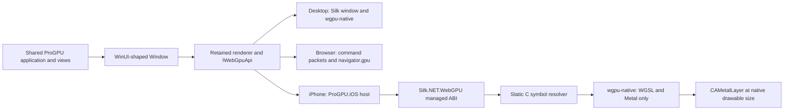

# Native iPhone WebGPU host

ProGPU now has an experimental native iPhone host. It runs the same
`ProGPU.Samples` application used by the desktop and browser executables, but
presents directly to a `CAMetalLayer` through WebGPU and `wgpu-native`. It does
not embed a browser, use `WKWebView`, or depend on MAUI or Uno.

## Architecture



The useful browser architecture is the platform-neutral boundary, not the
browser transport itself. Both hosts implement `IWindowHost`, install native
input/clipboard services, and drive `Window.InitializeExternalRenderer` and
`Window.RenderExternalFrame`. The browser must serialize commands across the
.NET/JavaScript boundary. iPhone has no such boundary, so reusing the command
arena or JavaScript decoder would add CPU work and latency without adding
portability.

`MetalRenderView` owns one `CAMetalLayer`. Its drawable size is the view bounds
multiplied by the current scene screen's `NativeScale`, while ProGPU continues
to arrange content in logical coordinates. A `CADisplayLink` drives frames at
the screen's maximum refresh rate and is paused while the scene is inactive.
The layer allows three outstanding drawables. Surface loss or an outdated
surface triggers configuration with the current physical dimensions before
the frame is retried.

The initial host supports one UIKit scene and one top-level ProGPU `Window`.
Popups, menus, flyouts, tooltips, and dialogs remain compositor layers. Touch
and Apple Pencil input include stable pointer IDs, pressure, contact bounds,
and microsecond timestamps. Indirect input uses separate UIKit recognizers for
hover, scroll, and transform events. A gesture delegate admits only the native
event family owned by each recognizer and rejects direct touches, which remain
on the normal multi-touch path. Scroll translation is preserved as precise 2D
logical-pixel deltas; pinch scale is carried as `120 * ln(scale)` so zoom
consumers can reconstruct the exact multiplicative scale. Indirect-pointer
touches become WinUI mouse contacts with primary, secondary, and middle button
masks, enabling capture and drag/drop without a compatibility touch adapter.
The sample explicitly enables
`UIApplicationSupportsIndirectInputEvents`; Apple's current compatibility
guidance requires that opt-in for reliable indirect input when the deployment
target predates iOS 17. A UIKit text-input bridge supplies software and
hardware keyboard input, exact replacement ranges, selection, marked-text composition,
deletion, return keys, password mode, capitalization, spell-checking,
dictation/autocorrection edits, and input-scope keyboard selection. Clipboard
text uses `UIPasteboard`.

File-open, file-save, and folder selection use UIKit's native document picker.
Open requests copy the selected document into the application container so the
portable `StorageFile` read APIs remain safe. Save and folder requests retain
their security-scoped URLs for the host lifetime; writes are performed through
`NSFileCoordinator` before the scope is released at shutdown.

`FramebufferOnly`, three drawable slots, native physical drawable dimensions,
the screen's maximum refresh range, a single shared `WgpuContext`, and direct
static C ABI dispatch keep the native route equivalent to the desktop renderer
where the platforms permit. There is no JavaScript command serialization,
readback, intermediate canvas, or second rendering framework on iPhone.

## Dependencies and ABI contract

The managed host uses the platform assemblies from the .NET iOS workload and
the repository's existing Silk.NET WebGPU binding. The only additional native
component is `wgpu-native`, built from source as an XCFramework. Its Cargo
features are restricted to `wgsl,metal`; the default GLSL, SPIR-V, and
non-Apple graphics backends are excluded.

Silk.NET.WebGPU 2.23.0 was generated for a May 2024 WebGPU C ABI. The iOS build
therefore pins `wgpu-native` commit
`33133da4ec5a0174cb21539ef2d3346f75200411`. A newer native library is not a
drop-in replacement: callback-info layouts, surface source tags, device error
callbacks, and render-pass attachment layouts changed. Upgrade Silk's managed
binding and the native commit as one reviewed change.

iOS cannot dynamically load an ordinary native WebGPU library. The build
generates a small C resolver whose table is derived from the pinned public
headers, compiles it for device and simulator, and combines it with the Rust
static archive. This both gives Silk function pointers and roots the symbols
against native-linker dead stripping. The generated source and all cloned
third-party source remain under ignored `artifacts/`; no upstream
implementation is copied into ProGPU.

## Build and run

Prerequisites:

- macOS with a current Xcode and an installed iOS Simulator runtime.
- .NET 10 SDK with the iOS workload: `dotnet workload install ios`.
- Rust and the Apple ARM64 targets (the native build script installs the
  targets when missing).

Build the ABI-compatible Metal-only native library:

```bash
./eng/build-wgpu-native-ios.sh
```

Build and launch an Apple Silicon simulator application:

```bash
progpu_simulator_id="$(xcrun simctl create \
  "ProGPU iPhone 17 Pro" \
  com.apple.CoreSimulator.SimDeviceType.iPhone-17-Pro \
  com.apple.CoreSimulator.SimRuntime.iOS-26-4)"
xcrun simctl boot "${progpu_simulator_id}"
xcrun simctl bootstatus "${progpu_simulator_id}" -b
dotnet build src/ProGPU.Samples.iOS/ProGPU.Samples.iOS.csproj \
  -c Debug -r iossimulator-arm64
xcrun simctl install "${progpu_simulator_id}" \
  src/ProGPU.Samples.iOS/bin/Debug/net10.0-ios/iossimulator-arm64/ProGPU.Samples.iOS.app
xcrun simctl launch "${progpu_simulator_id}" com.progpu.samples
```

Use an explicit dedicated simulator identifier as above; `booted` can target an
unrelated simulator that another application or test run is already using.

The native input design follows Apple's [trackpad and mouse input guidance](https://developer.apple.com/videos/play/wwdc2020/10094/):
`UIPanGestureRecognizer.allowedScrollTypesMask` opts into scroll events,
`UIPinchGestureRecognizer` consumes transform events, `UIHoverGestureRecognizer`
tracks an unpressed pointer, and `UIEvent.buttonMask` identifies mouse buttons.
The event delegate intentionally reads `UIEvent.Type` because non-touch scroll
and transform events have zero touches after the indirect-input opt-in. Disjoint
continuous and discrete pan recognizers retain logical-pixel trackpad deltas while
normalizing mouse-wheel detents to the same line units used by desktop hosts.
Pinch scale is transported without step quantization as `120 * ln(relativeScale)` and
reconstructed by zooming controls with `exp(delta / 120)`. Pointer location falls back to the last
hover/click position (or the view center for the first event), because a touchless
scroll or transform event may report an empty recognizer location.

The portable input layer also implements the current
[`Microsoft.UI.Input.GestureRecognizer`](https://learn.microsoft.com/en-us/windows/windows-app-sdk/api/winrt/microsoft.ui.input.gesturerecognizer)
contract: official gesture-setting values, pointer-point metadata, tap/double-tap,
right-tap, holding, mouse/pen dragging, touch cross-slide, one- and multi-pointer
translation/rails/scale/rotation, wheel manipulation, configurable manual or
automatic inertia, and completion. XAML routed gesture arguments expose the WinUI
container, pivot, position, device, cumulative/delta/velocity, completion, and
inertia-behavior surfaces using the current `Microsoft.UI.Input` value and device
types. Routed inertia produces timed `ManipulationDelta` events, honors desired
deceleration or displacement/angle/expansion, supports interruption by a new contact,
and completes only after motion stops. Recognition is `O(P)` time per sample and `O(P)` retained
state for `P` active contacts; wheel, tap, drag, and inertia steps are `O(1)` and
allocation-free after event construction.

### Responsive offscreen effects

The Compute FX preview sizes its reusable offscreen gear scene from the actual
arranged preview control. Compact `ResponsiveSplitView` panes are overlays and
therefore reserve no width; the old desktop-only `window width - pane width`
estimate produced a narrow texture that was stretched across the iPhone preview.
The hot path remains fixed work outside the existing scene compilation, texture
resize, and compute dispatches: reading the retained preview size is `O(1)` with
no per-frame discovery or allocation.

This follows the explicit target-size model used by [Skia surfaces](https://api.skia.org/classSkSurface.html),
[Direct2D render targets](https://learn.microsoft.com/en-us/windows/win32/direct2d/render-targets-overview),
[Win2D offscreen targets](https://microsoft.github.io/Win2D/WinUI3/html/DPI.htm),
[WebRender render tasks](https://github.com/mozilla/gecko-dev/blob/master/gfx/wr/webrender/src/render_task.rs),
and [Vello `RenderParams`](https://github.com/linebender/vello): the scene viewport
and target dimensions must describe the destination that will consume the image.
ProGPU adopts that sizing contract while retaining its existing texture objects,
compute pipelines, and demand-driven resize behavior. SkParagraph and HarfBuzz
were also reviewed as required; their reusable shaping/layout separation remains
unchanged because this defect is confined to a non-text offscreen target.
The fixed fully trimmed simulator build sustained the 60 FPS display cadence on
the Compute FX page; simulator timing is functional evidence only, with physical
iPhone frame-time, thermal, and power measurements still required for release.

Use `-c Release` to validate the fully AOT-compiled path. Debug enables the
.NET interpreter and SDK-only trimming to keep edit/build cycles practical on
the simulator. Release uses full application trimming and does not enable the
interpreter, reducing the shipped managed graph before native AOT.

On iOS and browser, the shared Rich Document Editor selects the portable
text/Markdown/RTF/HTML registry. Desktop also registers DOCX. This makes the
OpenXML package unreachable and removes it entirely from the fully linked iOS
application and AOT graph without removing the editor from the shared sample.

For a physical iPhone, select a signing identity and provisioning profile in
the usual .NET iOS/MSBuild way, then build or publish `-r ios-arm64`. The
XCFramework already contains both `ios-arm64` and
`iossimulator-arm64` slices. A physical device is the required source of final
frame-time, thermal, memory, and power measurements; simulator FPS is only a
functional signal.

## Shared sample and WinUI-shaped app model

`ProGPU.Samples.iOS` contains only native startup metadata and a call to
`IosApplication.Run<ProGPU.Samples.App>()`. Pages, retained scene content,
shaders, and application startup remain in `ProGPU.Samples`, exactly as they do
for desktop and browser.

The platform work also aligns the portable application/window surface with the
official WinUI contract used by mobile hosting:

- `Window` derives from `DependencyObject`.
- activation, close, size, and visibility events use WinRT-style
  `TypedEventHandler<object, TEventArgs>` signatures;
- `WindowActivationState`, `WindowEventArgs`, `WindowSizeChangedEventArgs`, and
  `WindowVisibilityChangedEventArgs.Handled` are available;
- `Bounds`, `Visible`, and nullable `SetTitleBar` are exposed;
- `Application.Start(ApplicationInitializationCallback)` and the official
  string-shaped `LaunchActivatedEventArgs.Arguments` are supported;
- unhandled launch exceptions can be marked handled, otherwise their original
  stack is preserved.

These APIs are host-neutral. Browser and iOS hosts report activation,
visibility, logical size, and DPI through the same internal notifications.

### Insets and the software keyboard

The portable layer exposes the official `Windows.UI.ViewManagement.InputPane`
shape, including `OccludedRect`, `Showing`, `Hiding`, `TryShow`, `TryHide`, and
`InputPaneVisibilityEventArgs.EnsuredFocusedElementInView`. WinUI does not
publish a cross-platform safe-area contract, so ProGPU adds the deliberately
small `Window.Insets` value with `SafeArea`, `InputPaneOccludedRect`, and
`VisibleBounds`, plus `InsetsChanged` and `ExtendsContentIntoSystemInsets`.

UIKit safe-area insets remain in logical points. Ordinary content is arranged
inside those insets, while the backdrop covers the full drawable. A docked,
full-width keyboard reduces the content's bottom visible bound; an undocked or
floating keyboard is reported through `InputPane` without incorrectly
shrinking the whole window. The focused editor is revealed through the nearest
`ScrollViewer` or `DataGrid` when possible.

### Variable-size virtualization and DataGrid wrapping

`VariableSizeIndex` is shared by `VirtualizingStackPanel` and `DataGrid`. It
uses a Fenwick prefix-sum tree: measured-size updates, item-to-offset lookup,
and offset-to-item lookup are `O(log N)`; retained numeric state is `O(N)`;
insert/remove operations preserve existing measurements in `O(N)`. A viewport
anchor prevents newly measured rows above the viewport from moving visible
content. `VirtualizingStackPanel.CacheLength` defaults to one viewport before
and after the visible viewport, making a three-viewport realization window.

Set `VirtualizingStackPanel.ItemHeight` or `DataGrid.RowHeight` to `float.NaN`
for variable sizing. `EstimatedItemHeight`/`EstimatedRowHeight` stabilize the
unmeasured extent. `DataGrid.CellTextWrapping` follows the WinUI
`TextWrapping` values, and each `DataGridColumn.TextWrapping` can override it;
wrapped cell layout determines the realized row height and remains clipped to
its cell.

## Research record and decisions

This implementation is clean-room work based on public contracts and primary
sources. No implementation was copied or translated from another engine.

| Source | Relevant production behavior | ProGPU decision |
| --- | --- | --- |
| [wgpu](https://github.com/gfx-rs/wgpu) and [wgpu-native](https://github.com/gfx-rs/wgpu-native) | WebGPU implementation with Metal support and a C API | Adopt direct WebGPU-to-Metal; pin the exact C ABI consumed by Silk. |
| [Apple native screen scale guidance](https://developer.apple.com/library/archive/documentation/3DDrawing/Conceptual/MTLBestPracticesGuide/NativeScreenScale.html), [`CAMetalLayer.drawableSize`](https://developer.apple.com/documentation/quartzcore/cametallayer/drawablesize), and [drawable guidance](https://developer.apple.com/library/archive/documentation/3DDrawing/Conceptual/MTLBestPracticesGuide/Drawables.html) | Separate logical view coordinates from physical render targets and acquire drawables only when rendering | Adopt native-scale framebuffer sizing, lazy per-frame acquisition, and a bounded drawable queue. |
| [`CADisplayLink`](https://learn.microsoft.com/en-us/dotnet/api/coreanimation.cadisplaylink) and [`CAMetalDisplayLink`](https://developer.apple.com/documentation/quartzcore/cametaldisplaylink) | Display-synchronized frame callbacks and lifecycle-aware presentation | Use the broadly available `CADisplayLink` for iOS 15+, with a host boundary that can move to `CAMetalDisplayLink` when the deployment target permits. |
| [.NET for iOS](https://learn.microsoft.com/en-us/dotnet/ios/) and [`NativeReference`](https://learn.microsoft.com/en-us/dotnet/maui/migration/ios-binding-projects) | Native Apple app lifecycle, AOT, and static framework linking | Adopt a thin UIKit scene host and XCFramework reference; reject a second UI framework dependency. |
| [WebGPU specification](https://gpuweb.github.io/gpuweb/) and [explainer](https://gpuweb.github.io/gpuweb/explainer/) | Portable command model, explicit surface/resource lifetime, asynchronous device behavior | Preserve ProGPU's typed WebGPU boundary and device-loss reporting. |
| [Skia GPU surfaces](https://skia.org/docs/user/api/skcanvas_creation/) and [Skia API](https://skia.org/docs/user/api/) | Host-owned GPU contexts and reusable drawing state | Adapt the single host-owned GPU context and retained-resource lifetime model; do not introduce a second canvas scene. |
| [Direct2D resource domains](https://learn.microsoft.com/en-us/windows/win32/direct2d/resources-and-resource-domains) and [Win2D device-loss handling](https://learn.microsoft.com/en-us/windows/apps/develop/win2d/handling-device-lost) | Device-dependent resources and explicit recovery | Preserve surface/device generation invalidation and make terminal device loss observable. |
| [WebRender](https://doc.servo.org/webrender/) and [Vello](https://github.com/linebender/vello) | Retained scenes, batching/caching, and GPU parallelism | Keep ProGPU's retained compiled scene and GPU raster/composition; reject a platform-specific renderer fork. |
| [HarfBuzz shaping plans and caching](https://harfbuzz.github.io/shaping-plans-and-caching.html) | Reusable CPU shaping plans/results | Keep shaping and line layout on the CPU and reusable across frames; only visibility, upload, rasterization, and composition move through the GPU. |
| [WinUI `Window`](https://learn.microsoft.com/en-us/windows/windows-app-sdk/api/winrt/microsoft.ui.xaml.window) and the [Microsoft UI XAML model](https://github.com/microsoft/microsoft-ui-xaml/blob/main/src/dxaml/xcp/tools/XCPTypesAutoGen/XamlOM/Model/Microsoft.UI.Xaml.cs) | Official app/window event shapes and state | Match the public API shapes needed by native lifecycle hosts without adding UIKit types to portable assemblies. |
| [WinUI/UWP `InputPane`](https://learn.microsoft.com/en-us/uwp/api/windows.ui.viewmanagement.inputpane), [`OccludedRect`](https://learn.microsoft.com/en-us/uwp/api/windows.ui.viewmanagement.inputpane.occludedrect), and [`InputPaneVisibilityEventArgs`](https://learn.microsoft.com/en-us/uwp/api/windows.ui.viewmanagement.inputpanevisibilityeventargs) | Portable keyboard visibility, occlusion, and focused-element reporting | Match the official API shape and keep UIKit geometry out of application code. |
| [`UIView.safeAreaInsets`](https://developer.apple.com/documentation/uikit/uiview/safeareainsets), [`safeAreaInsetsDidChange`](https://developer.apple.com/documentation/uikit/uiview/safeareainsetsdidchange()), and [`keyboardLayoutGuide`](https://developer.apple.com/documentation/uikit/uiview/keyboardlayoutguide) | System-bar/cutout geometry and keyboard-aware layout | Report logical inset/occlusion values; inset app content without reducing the Metal drawable. |
| [`UITextInput`](https://developer.apple.com/documentation/uikit/uitextinput) and [`setMarkedText`](https://developer.apple.com/documentation/uikit/uitextinput/setmarkedtext(_:selectedrange:)) | Exact document replacements, selection, and IME marked-text lifecycle | Let UIKit own its native editing document and mirror exact changes into typed ProGPU text operations. |
| [`UIPanGestureRecognizer.allowedScrollTypesMask`](https://developer.apple.com/documentation/uikit/uipangesturerecognizer/allowedscrolltypesmask), [`UIScrollTypeMask`](https://developer.apple.com/documentation/uikit/uiscrolltypemask), and [`allowedTouchTypes`](https://developer.apple.com/documentation/uikit/uigesturerecognizer/allowedtouchtypes) | Indirect scrolling distinguishes continuous trackpads from discrete mouse wheels independently from direct touches | Use disjoint continuous/discrete recognizers, exclude direct touches, preserve trackpad pixels, and normalize discrete detents. |
| [Apple TN3210: Optimizing your app for iPhone Mirroring](https://developer.apple.com/documentation/technotes/tn3210-optimizing-your-app-for-iphone-mirroring) | Compatibility requirements for indirect scroll events in apps with older deployment targets | Set `UIApplicationSupportsIndirectInputEvents` to `YES` because the sample supports iOS 15, then use UIKit's built-in pan recognizer for both continuous and discrete scroll events. |
| [Windows App SDK `GestureRecognizer`](https://learn.microsoft.com/en-us/windows/windows-app-sdk/api/winrt/microsoft.ui.input.gesturerecognizer), [`GestureSettings`](https://learn.microsoft.com/en-us/windows/windows-app-sdk/api/winrt/microsoft.ui.input.gesturesettings), and [XAML manipulation events](https://learn.microsoft.com/en-us/windows/apps/design/input/touch-interactions) | Public gesture ingestion, settings, typed event payloads, completion, and inertia contracts | Match the Microsoft API surface and implement an original typed recognizer shared by every host; UIKit remains an input adapter rather than a second gesture model. |
| [`UIDocumentPickerViewController`](https://developer.apple.com/documentation/uikit/uidocumentpickerviewcontroller), [`UTType`](https://developer.apple.com/documentation/uniformtypeidentifiers/uttypereference), and [WinUI file-management guidance](https://learn.microsoft.com/en-us/windows/apps/develop/files/) | Native file/folder selection, extension filtering, save destinations, and sandbox-safe access | Preserve the WinUI-shaped asynchronous picker contract while presenting Files UI, copying opened documents locally, and retaining/coordinating security-scoped save and folder URLs. |
| [WinUI `ItemsRepeater`](https://learn.microsoft.com/en-us/windows/apps/design/controls/items-repeater), [`VirtualizingLayoutContext`](https://learn.microsoft.com/en-us/windows/windows-app-sdk/api/winrt/microsoft.ui.xaml.controls.virtualizinglayoutcontext), and [attached-layout guidance](https://learn.microsoft.com/en-us/windows/apps/design/controls/items-repeater#attached-layouts) | Viewport-driven realization, recycling, and variable-sized layouts | Share a prefix-sum geometry index, use bounded overscan, recycle containers, and preserve scroll anchors. |

Startup remains lazy: no WebGPU instance, adapter, device, or surface is created
until the shared application activates its window. Shaping/layout results,
retained commands, atlases, and pipeline caches remain owned by the existing
renderer. Visibility and lifecycle changes pause production instead of
invalidating stable content. No GPU shaping rewrite or iPhone-only scene
compiler was introduced.

## Current validation and limits

The fully trimmed Release gallery has been built, installed, launched, and
rendered through native WebGPU/Metal on a dedicated iPhone 17 Pro simulator at
its physical drawable size. The linked Release app contains the static WebGPU
resolver and no OpenXML assembly. The portable API compatibility tests cover
event signatures/state, nullable title
bars, launch arguments, and `Application.Start` thread behavior. The complete
portable suite currently passes 2,196 tests, and the complete headless GPU
suite passes 195 tests. Focused coverage includes safe-area and floating/docked
keyboard geometry, exact replacement/selection and IME cancellation, precise
two-axis scrolling, variable-size prefix lookup and anchoring, wrapped DataGrid
row measurement, and an actual offscreen GPU render of the virtualized sample.

Still required before calling the host production-ready:

- run sustained cold-start, first-interaction, scrolling percentile, memory,
  thermal, and image-comparison measurements on physical iPhone hardware;
- add native external drag/drop, accessibility-tree, and other platform
  services as applications require them;
- add multi-scene/multi-window policy if ProGPU applications need more than one
  top-level UIKit scene;
- implement automatic application-level reconstruction after terminal WebGPU
  device loss. Surface loss already reconfigures in place.
